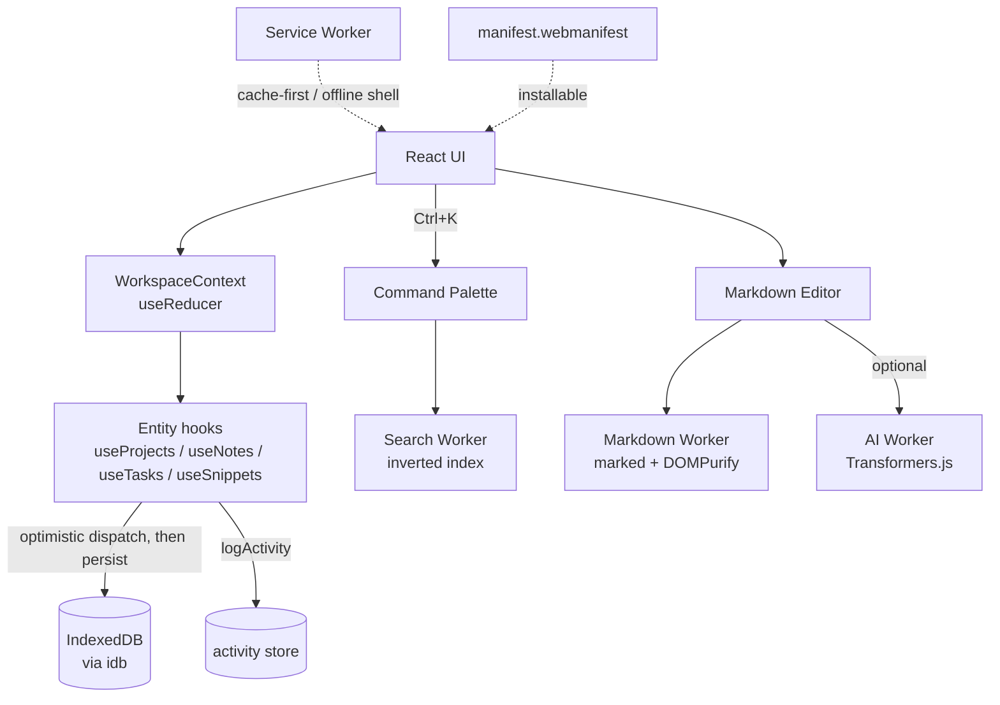

# DevFlow — Local-First Developer Workspace

DevFlow is a browser-based developer workspace: projects, Markdown notes, a Kanban task board, and a code snippet manager, all built on the premise that a browser tab can behave like a real application, not just a document viewer. Everything lives on your device. There is no backend, no account, and no network dependency for the core product — DevFlow works the same on a plane as it does on fiber.

It's built to demonstrate a specific idea: **React manages UI state, IndexedDB is the durable source of truth, Web Workers absorb the CPU-heavy work, and a Service Worker turns the whole thing into an installable, offline-capable app.** Every one of those pieces is real — no mocked workers, no fabricated performance numbers, no fake "active" badges.

## Live Demo

**[devflow-fz17.vercel.app](https://devflow-fz17.vercel.app)**

## Why this exists

Most portfolio CRUD apps prove you can call a REST API and render a list. DevFlow proves something else: that you can design a coherent local-first system where the browser *is* the platform — durable storage, background computation, offline resilience, and installability, all engineered deliberately rather than bolted on.

## Live architecture



## Technology stack

- **React 19 + Vite** — plain JavaScript, no TypeScript (a deliberate choice: this project's complexity is architectural, not type-level)
- **React Router 7** — client-side routing; deep-linkable project workspaces and note selection
- **IndexedDB via [`idb`](https://github.com/jakearchibald/idb)** — a thin Promise wrapper, not an ORM; the data-layer abstraction is hand-built in `src/db/`
- **[`marked`](https://github.com/markedjs/marked) + [`dompurify`](https://github.com/cure53/DOMPurify)** — Markdown parsing and sanitization
- **[`@xenova/transformers`](https://github.com/xenova/transformers.js)** — optional, lazy-loaded local AI (note summarization), no cloud calls
- No state-management library, no CSS framework, no drag-and-drop library, no icon library — Context + `useReducer`, CSS custom properties, native HTML5 drag-and-drop, and a dozen hand-drawn SVG icon paths turned out to be sufficient. Every dependency in `package.json` earns its place; nothing was added to make a simple thing look sophisticated.

## Application structure

```
devflow/
├── public/
│   ├── icons/                  # Hand-authored SVG app icons (standard + maskable)
│   ├── manifest.webmanifest
│   └── service-worker.js       # Hand-written — no build plugin
├── src/
│   ├── components/             # Grouped by domain: projects, notes, tasks, snippets,
│   │                           # search, command, activity, storage, performance, ai,
│   │                           # settings, layout, common (shared primitives)
│   ├── pages/                  # One file per route
│   ├── context/                # Theme, Network, Workspace, ServiceWorker
│   ├── hooks/                  # One hook per concern — CRUD, autosave, search, workers…
│   ├── db/                     # IndexedDB schema + per-entity stores
│   ├── workers/                # search.worker, markdown.worker, ai.worker + their clients
│   ├── services/                # Cross-cutting browser integrations (SW registration,
│   │                           # PWA install prompt, File System Access, import/export)
│   ├── config/                 # Data-driven config: nav items, commands, statuses,
│   │                           # priorities, languages — see "Dynamic UI" below
│   └── utils/                  # Pure helpers: formatting, validation, id, storage, perf
```

## The data layer

Every entity (`projects`, `notes`, `tasks`, `snippets`, `activity`) follows the same shape in `src/db/`:

- `buildX(data)` — constructs a record client-side, no I/O (used for optimistic UI)
- `saveX(record)` / `createX(data)` — persists via a shared `createStore(storeName)` factory in `database.js` that wraps every IndexedDB transaction so no component ever touches a raw transaction
- `getAllX()`, `getXByProject()`, etc. — typed queries via indexes declared in the schema
- `updateX(id, patch)`, `deleteX(id)` — read-modify-write with `updatedAt` stamping

Schema upgrades in `database.js` are additive (`if (oldVersion < N)` blocks), so the migration path never rewrites history.

### Local-first flow

Every write follows the same path, everywhere in the app:

```
User action → build record client-side → dispatch to reducer (optimistic)
    → persist to IndexedDB → log activity → on failure, roll back the dispatch
```

`WorkspaceContext` uses one **generic entity-slice reducer** (`actionTypes(entity)` + `sliceReducer`) shared by all five entities instead of five hand-written reducers — adding a new entity means adding a slice key, not new reducer logic. Each `useX()` hook owns the actual business logic (optimistic dispatch, persistence, rollback-on-failure, activity logging via `useLogActivity`), keeping the context itself dumb and generic.

## Web Workers

Three workers, three different concerns, one shared pattern (`Worker` instance lazily created on first use, promise-based request/response client, timeout + crash recovery):

| Worker | Job | Notes |
|---|---|---|
| `search.worker.js` | Builds a real in-memory inverted index (title/tag/body token sets) over projects/notes/tasks/snippets; serves the Command Palette's live search | Re-indexes on a 250ms debounce whenever workspace data changes |
| `markdown.worker.js` | Parses Markdown via `marked` off the main thread | Result is sanitized with DOMPurify on the main thread just before render (the worker has no DOM) |
| `ai.worker.js` | Runs local note summarization via Transformers.js | Only instantiated when the user clicks "Summarize" — the ~150MB model and the library itself never touch the initial bundle |

## Service Worker & offline

`public/service-worker.js` is hand-written, not generated by a plugin:

- **Install**: precaches the app shell (`/`, `/index.html`)
- **Activate**: deletes any cache not matching the current version string
- **Fetch**: network-first-with-cache-fallback for navigations (so a cached shell serves the SPA even offline), cache-first for same-origin GET requests otherwise — explicitly skipping Vite's dev-only module paths so local development is never affected by its own caching
- **Update flow**: `services/serviceWorker.js` detects a waiting worker and surfaces a real "reload to update" banner; nothing auto-activates behind the user's back

Offline behavior: IndexedDB, all CRUD, search, and Markdown editing work identically offline — none of it depends on the network in the first place. The Service Worker's job is narrower and specific: serve the app shell and static assets when the network is gone.

## PWA

`manifest.webmanifest` declares `display: standalone`, theme/background colors matching the actual app palette, and two hand-drawn SVG icons (standard + maskable with correct safe-zone padding). Install is offered via `beforeinstallprompt`, captured at module load (before React mounts, so an early-firing event isn't missed) and surfaced two ways: a dismissible banner and a persistent control in Settings that honestly reports installed / available / unavailable.

## Search & the Command Palette

Ctrl+K opens one unified overlay (`CommandPalette.jsx`) that merges two things:

- **Commands** — a static, config-driven list (`config/commands.js`): Create Project/Note/Task/Snippet, Toggle Theme, Open Settings/Storage/Performance, Export/Import Workspace. Filtered by label substring match.
- **Content search** — the same Search Worker index described above, grouped by type.

Cross-page commands like "Create Note" work by navigating with router state (`{ state: { openCreate: true } }`); the target page's `useOpenCreateSignal` hook consumes it once and clears it, so back/forward never replays it.

## Import / export

Full workspace export/import as JSON, with real validation: structural checks first (right shape, right arrays), then per-record validation that filters out malformed items rather than aborting the whole import — the UI shows an **Import Preview** with per-type counts and a skip warning before anything touches IndexedDB. Export prefers the File System Access "Save As" picker when available, falling back to a plain Blob download.

## File System Access API

Used in two places — workspace export/import (Settings) and single-note export as `.md` (Notes) — both via one shared `services/fileSystem.js` wrapper that detects support, tries the native picker, and falls back to the existing download/upload flow on any failure (unsupported, denied, or cancelled). Capability status is shown live in Settings, not assumed.

## Local AI (optional)

One feature, built completely rather than four built shallowly: **note summarization**, running entirely in-browser via Transformers.js (`Xenova/distilbart-cnn-6-6`). No cloud AI exists in this app — no API keys, nothing to configure, nothing to leak. The model downloads on first use (real progress reported from the library's own `progress_callback`, forwarded through the worker), is cached by the browser afterward, and the whole feature degrades to "unavailable" cleanly if Workers aren't supported. The rest of DevFlow has zero dependency on this feature working.

## Performance

`pages/Performance.jsx` and the Dashboard's status row report only real, API-sourced values — anything unsupported shows "Unavailable," never a fabricated number:

- Navigation Timing (TTFB, DOM interactive, DOM content loaded, full load) via `performance.getEntriesByType('navigation')`
- FPS via a continuous `requestAnimationFrame` sampler
- JS heap usage via `performance.memory` (Chrome-only; `null` everywhere else)
- Worker liveness (`isXWorkerActive()` — true only once a worker has actually been instantiated, not just "supported")
- IndexedDB / Service Worker / network / storage-quota status, shared via context so Dashboard and Performance never disagree

## Dynamic / data-driven UI

Sidebar navigation, task statuses and priorities, project statuses, snippet languages, search result grouping, and command palette entries are all arrays of plain objects in `src/config/`. Adding a task priority or a supported snippet language is a one-line config change, not a hunt through JSX.

## Theming

Every color is a CSS custom property defined once in `src/index.css` under `[data-theme="dark"]` / `[data-theme="light"]`. No component hardcodes a hex value. `prefers-reduced-motion` is honored globally via one wildcard rule collapsing all transition/animation durations — not per-component opt-ins that are easy to forget.

## Accessibility

Semantic HTML, a skip-to-content link, visible focus rings everywhere, `role`/`aria-*` on the Command Palette (combobox + listbox pattern) and all dialogs (`role="dialog"`, `aria-modal`, real focus trap + Escape-to-close + focus restoration on close, built once in `Modal.jsx` and reused by every dialog in the app). Kanban drag-and-drop has a fully equivalent keyboard path — every task card exposes a "Move to" `<select>` alongside the drag handle, not a drag-only interaction. A WCAG contrast audit during the polish pass caught `--text-tertiary` failing AA (3.09:1 / 3.65:1 against a 4.5:1 requirement) in both themes; it's now `#69707f` / `#8c94a5` (4.60:1 / 6.34:1).

## Browser compatibility

Built and tested against Chromium. IndexedDB, Web Workers, and the Cache API are broadly supported everywhere that matters. `performance.memory` is Chrome-only and reports "Unavailable" elsewhere — by design. The Service Worker and File System Access API are feature-detected with real fallbacks (see Known Limitations for how those were actually verified).

## Installation & development

```bash
git clone <repo-url> devflow
cd devflow
npm install
```

```bash
npm run dev       # http://localhost:5173, hot reload
npm run build      # production build to dist/
npm run preview    # serve the production build locally
npm run lint       # oxlint
```

No environment variables, no API keys, no backend to stand up. Clone, install, run.

## Known limitations

**Honest, not hand-wavy** — these were found by testing in a sandboxed automation browser during development, and each was root-caused rather than assumed:

- **Service Worker registration**: this dev sandbox blocks `navigator.serviceWorker.register()` outright (the script fetches fine, `register()` fails with a generic error) — a browser-instance policy restriction, not a code defect. Verify in a normal Chrome tab: DevTools → Application → Service Workers.
- **Clipboard API**: both `navigator.clipboard.writeText()` and the `execCommand('copy')` fallback are blocked in this sandbox (no user-activation grant reaches the page). The UI correctly reports "Copy failed" rather than failing silently — verified this is the *correct* error path, not a bug.
- **File System Access API**: `showSaveFilePicker()`/`showOpenFilePicker()` correctly fire (capability detection genuinely reports "supported") but hang indefinitely — no display surface for the native OS dialog in this sandbox. The rest of the app stays fully responsive while that one promise is pending (verified by running the DB self-test mid-hang). The fallback path (plain download / hidden file input) was exercised end-to-end by temporarily deleting the picker APIs at runtime and confirming full recovery.
- **`npm audit`** flags critical/high transitive vulnerabilities in `protobufjs`/`sharp`, pulled in via `onnxruntime-web` (a dependency of `@xenova/transformers`). These are in Node-side/build-tooling code paths (ONNX schema codegen, native image preprocessing) that the browser bundle never executes — a long-standing, known situation across the ML tooling ecosystem, not something worth a breaking forced downgrade.
- **`--accent` contrast**: sits at 4.33–4.46:1 in dark mode (both as text-on-background and white-text-on-button), just under the 4.5 AA threshold in two directions that pull toward opposite fixes. Left as-is rather than cascading a brand-color change across every button in the app for a 0.2 gap.

## Roadmap

- Semantic search (embeddings-based, alongside the existing lexical index) as a second local-AI feature
- Per-column WIP limits and swimlanes on the task board
- Snippet syntax highlighting (deliberately deferred — see Lessons Learned)
- Cascading delete for a project's notes/tasks/snippets (currently orthogonal; deleting a project doesn't touch its associated records, since none of those associations existed yet when project deletion first shipped)
- Real cross-tab sync via `BroadcastChannel` so two open tabs converge without a manual reload

## Lessons learned

- **Installing a package while the dev server is running corrupts Vite's pre-bundle cache.** Every dependency added mid-session (`react-router-dom`, `dompurify`, `@xenova/transformers`) triggered `Invalid hook call` errors from a duplicated React copy until `node_modules/.vite` was cleared and the server restarted. Cheap to fix, easy to misdiagnose as a real bug the first time.
- **A form component that toggles `open={false}` but never unmounts keeps its `useState` lazy initializer forever.** `ProjectForm` and `TaskForm` both showed this: editing a record displayed stale/default values because the component had mounted once (on the very first "create" open) and never again. Fixed by conditionally rendering the form (`{formState && <Form key={...} />}`) instead of always rendering it with `open` toggled — forcing a real remount per edit session. Caught during Step 6 verification, not assumed away.
- **Syntax highlighting was deliberately left out of the snippet editor.** The spec frames snippets as "storage and organization," not code execution or IDE-grade editing — pulling in a highlighter (Prism, CodeMirror, Monaco) to make a textarea look fancier would have been exactly the kind of unjustified dependency this project's own principles argue against.
- **One AI feature, done completely, beat four done shallowly.** Semantic search needs persistent embedding management; code explanation needs a much heavier instruction-tuned model than reasonably fits in-browser. Summarization shipped as a real, verified, end-to-end feature — model download progress, worker isolation, graceful degradation, the works — rather than four half-working demos.
- **Every "unavailable" claim in this README was proven, not assumed.** Several browser APIs (Service Worker, Clipboard, File System Access) behaved unexpectedly in the sandboxed environment used for development-time verification. Each was root-caused with direct evidence (capability checks, raw API calls, console output) before being written up — the alternative, quietly working around a failure without understanding it, tends to produce documentation that's wrong in production.

<!-- Deployed via Vercel + GitHub auto-deploy -->
